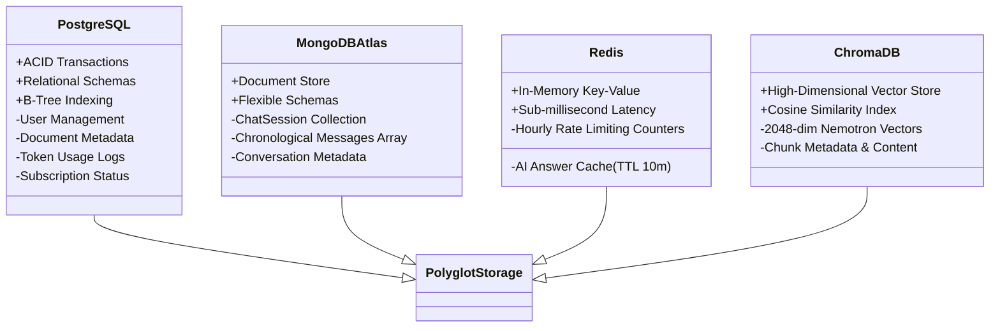
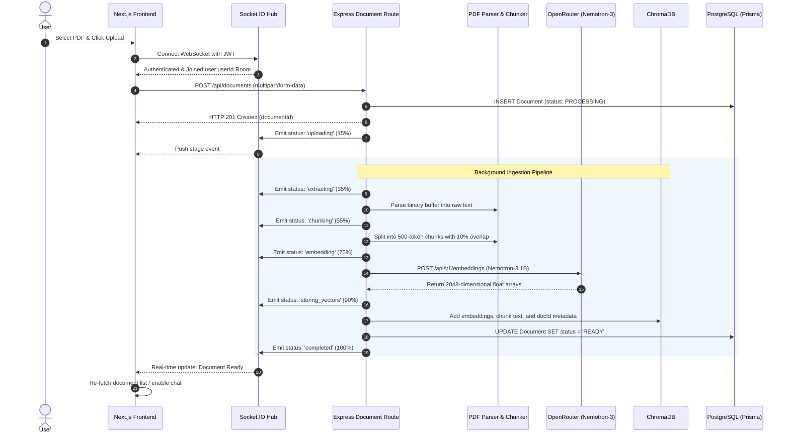
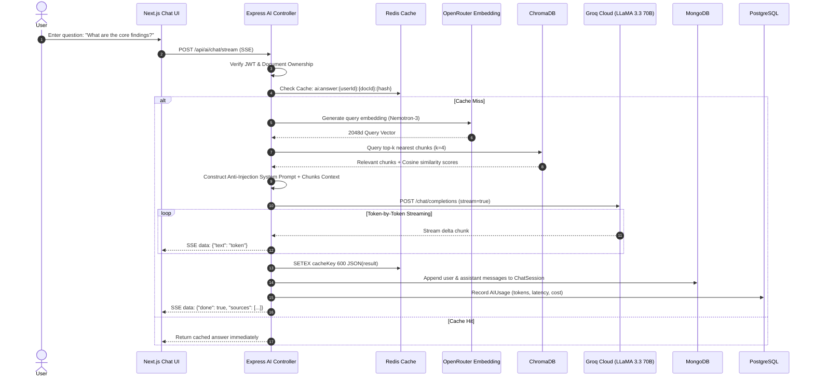
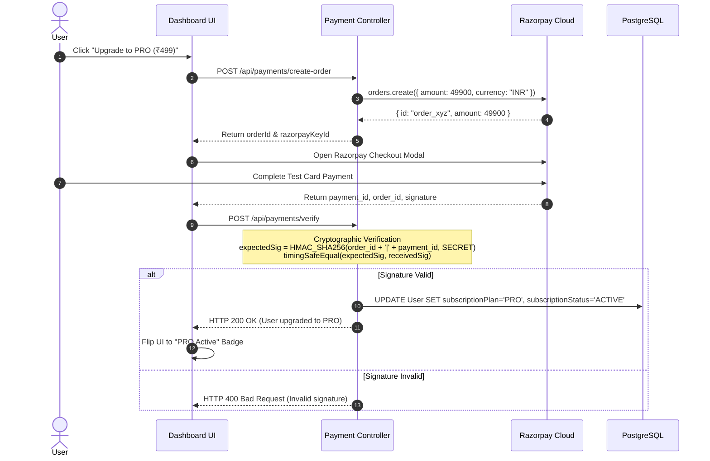

# High-Level Design (HLD) — DocuMind AI

**Project Name**: DocuMind AI  
**Architecture Paradigm**: Decoupled Client-Server with Polyglot Persistence, Event-Driven WebSockets & Streaming AI  
**Target Platform**: Linux/Docker / Node.js 20+ Runtime  

---

## 1. System Architecture Overview

DocuMind AI is architected as a modular, decoupled full-stack platform. The presentation layer is built on **Next.js (React 19, Turbopack)**, communicating via REST, SSE, and WebSockets to an **Express.js (TypeScript)** backend engine.

```mermaid
graph TB
    subgraph ClientLayer["Presentation Layer (Client)"]
        UI["Next.js 16 Web App<br/>(Tailwind CSS + Lucide Icons)"]
        SocketClient["Socket.IO Client<br/>(Real-Time Tracker)"]
        RazorpayModal["Razorpay Checkout SDK<br/>(Test Mode)"]
    end

    subgraph GatewayLayer["API & Middleware Layer"]
        Express["Express.js Server (Port 5000)"]
        Swagger["OpenAPI 3.0 / Swagger UI<br/>(/api-docs)"]
        AuthMid["JWT Auth Middleware<br/>(HMAC SHA-256)"]
        RateMid["Redis Rate Limiter<br/>(Sliding Window)"]
        ErrMid["Centralized Error Handler"]
    end

    subgraph ServiceLayer["Core Domain Services"]
        DocController["Document Ingestion Pipeline"]
        RAGService["RAG Retrieval & Streaming Engine"]
        AgentEngine["Multi-Step Autonomous Agent"]
        PaymentService["Razorpay Payment Service"]
        SocketService["Socket.IO WebSocket Manager"]
        CronService["Automated Usage Cleanup Cron"]
    end

    subgraph PolyglotPersistence["Polyglot Persistence Layer"]
        Postgres[(PostgreSQL 16 + Prisma)<br/>Users, Docs, AIUsage, Plans]
        MongoDB[(MongoDB Atlas + Mongoose)<br/>ChatSessions & Messages]
        Redis[(Redis Cache & Limiter)<br/>Key-Value Store]
        Chroma[(ChromaDB Vector DB)<br/>Cosine Distance Index]
    end

    subgraph ExternalAI["External AI & Payment Providers"]
        Groq["Groq Cloud API<br/>(LLaMA 3.3 70B Versatile)"]
        OpenRouter["OpenRouter API<br/>(Nemotron-3 Embed 1B - 2048d)"]
        RazorpayAPI["Razorpay API<br/>(Orders & Webhooks)"]
    end

    %% Connections
    UI -->|REST APIs| Express
    UI -->|Server-Sent Events| RAGService
    SocketClient <-->|WebSocket Events| SocketService
    RazorpayModal <-->|Checkout Flow| PaymentService

    Express --> Swagger
    Express --> AuthMid
    AuthMid --> RateMid
    RateMid --> ErrMid

    ErrMid --> DocController
    ErrMid --> RAGService
    ErrMid --> AgentEngine
    ErrMid --> PaymentService

    DocController -->|Store Metadata| Postgres
    DocController -->|Index Vectors| Chroma
    DocController -->|Push Events| SocketService
    DocController -->|Embeddings| OpenRouter

    RAGService -->|Vector Query| Chroma
    RAGService -->|LLM Streaming| Groq
    RAGService -->|Record Usage| Postgres
    RAGService -->|Save History| MongoDB
    RAGService -->|Cache Answers| Redis

    AgentEngine -->|Tools Execution| Groq
    AgentEngine -->|Vector Search| Chroma
    AgentEngine -->|Save History| MongoDB

    PaymentService -->|Order Creation & Verify| RazorpayAPI
    PaymentService -->|Update Subscription| Postgres

    CronService -->|Prune Old Logs| Postgres
```

---

## 2. Polyglot Persistence Architecture

DocuMind AI uses a **specialized multi-database persistence model** to maximize throughput, data integrity, and operational efficiency:



| Database | Primary Role | Key Queries / Operations | Why Chosen |
|---|---|---|---|
| **PostgreSQL 16** | Relational / ACID Master | User auth, doc metadata, usage analytics, joins | Strong consistency, foreign keys, transaction rollbacks |
| **MongoDB Atlas** | Document / Chat History | `ChatSession.findOneAndUpdate({ userId, docId })` | Dynamic message schemas, zero schema migrations for chats |
| **Redis** | In-Memory Cache & Limiter | `SETEX ai:answer:* 600`, `INCR ratelimit:*` | Sub-5ms response caching, atomic increments for rate-limiting |
| **ChromaDB** | Vector Database | Cosine distance similarity query on embeddings | Fast local embedding search, metadata filtering |

---

## 3. End-to-End Ingestion & Processing Data Flow



---

## 4. RAG Query & Token Streaming Flow



---

## 5. Razorpay Cryptographic Payment Verification Flow



---

## 6. Security & Defense in Depth

1. **Authentication**: Stateless JWT with HMAC SHA-256 tokens.
2. **Authorization**: Strict tenant isolation in DB queries (`where: { userId, id: documentId }`), returning HTTP 404 to prevent resource enumeration.
3. **Cryptographic Signatures**: Timing-safe HMAC SHA-256 validation for payments preventing side-channel timing attacks.
4. **Input Sanitization**: Strong Zod schema enforcement across all HTTP endpoints.
5. **AI Safety**: Multi-layer prompt injection filters preventing delimiter tampering, jailbreak keywords, and system prompt overrides.
6. **Error Masking**: Production errors masked to avoid leaking stack traces or credentials.
