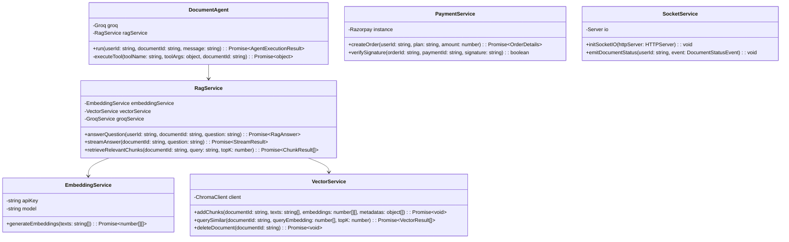
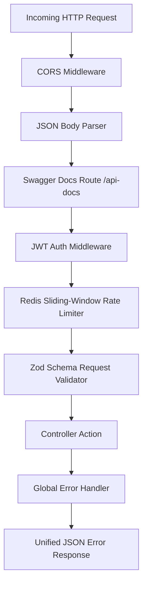
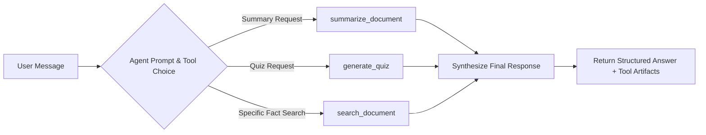

# Low-Level Design (LLD) — DocuMind AI

**Project Name**: DocuMind AI  
**Language / Runtime**: TypeScript 5.x / Node.js 20+  
**Frameworks**: Express.js (Backend) / Next.js 16 (Frontend)  
**Database Tooling**: Prisma ORM, Mongoose, ioredis, chromadb  

---

## 1. Database Schema & Data Models

### 1.1 PostgreSQL Relational Schema (`prisma/schema.prisma`)

```prisma
enum Role {
  USER
  ADMIN
}

enum DocumentStatus {
  UPLOADED
  PROCESSING
  READY
  FAILED
}

enum SubscriptionPlan {
  FREE
  PRO
}

enum SubscriptionStatus {
  ACTIVE
  INACTIVE
  CANCELLED
}

model User {
  id                 String             @id @default(uuid())
  email              String             @unique
  name               String
  passwordHash       String
  role               Role               @default(USER)
  subscriptionPlan   SubscriptionPlan   @default(FREE)
  subscriptionStatus SubscriptionStatus @default(ACTIVE)
  razorpayCustomerId String?
  createdAt          DateTime           @default(now())
  updatedAt          DateTime           @updatedAt

  documents          Document[]
  aiUsage            AIUsage[]

  @@index([createdAt])
}

model Document {
  id               String         @id @default(uuid())
  userId           String
  name             String
  originalFileName String
  filePath         String
  fileSize         Int
  mimeType         String
  status           DocumentStatus @default(UPLOADED)
  extractedText    String?        @db.Text
  createdAt        DateTime       @default(now())
  updatedAt        DateTime       @updatedAt

  user             User           @relation(fields: [userId], references: [id], onDelete: Cascade)
  aiUsage          AIUsage[]

  @@index([userId])
  @@index([createdAt])
}

model AIUsage {
  id           String   @id @default(uuid())
  userId       String
  documentId   String?
  model        String
  inputTokens  Int
  outputTokens Int
  totalTokens  Int
  latencyMs    Int
  createdAt    DateTime @default(now())

  user         User      @relation(fields: [userId], references: [id], onDelete: Cascade)
  document     Document? @relation(fields: [documentId], references: [id], onDelete: Cascade)

  @@index([userId])
  @@index([createdAt])
}
```

### 1.2 MongoDB Schema (`models/ChatSession.ts`)

```typescript
import mongoose, { Schema, Document } from 'mongoose';

export interface IMessage {
  role: 'user' | 'assistant' | 'system';
  content: string;
  createdAt: Date;
}

export interface IChatSession extends Document {
  userId: string;
  documentId: string;
  messages: IMessage[];
  createdAt: Date;
  updatedAt: Date;
}

const MessageSchema = new Schema<IMessage>({
  role: { type: String, required: true, enum: ['user', 'assistant', 'system'] },
  content: { type: String, required: true },
  createdAt: { type: Date, default: Date.now },
});

const ChatSessionSchema = new Schema<IChatSession>(
  {
    userId: { type: String, required: true, index: true },
    documentId: { type: String, required: true, index: true },
    messages: [MessageSchema],
  },
  { timestamps: true }
);

ChatSessionSchema.index({ userId: 1, documentId: 1 }, { unique: true });

export const ChatSession = mongoose.model<IChatSession>('ChatSession', ChatSessionSchema);
```

---

## 2. Core Service Architecture & Signatures



---

## 3. Middleware Pipeline & Error Hierarchy



### Error Representation (`utils/errors.ts`)

```typescript
export type ErrorCode =
  | 'VALIDATION_ERROR'
  | 'UNAUTHORIZED'
  | 'FORBIDDEN'
  | 'NOT_FOUND'
  | 'CONFLICT'
  | 'PAYLOAD_TOO_LARGE'
  | 'RATE_LIMITED'
  | 'INTERNAL_SERVER_ERROR';

export class AppError extends Error {
  public statusCode: number;
  public code: ErrorCode;
  public details?: ErrorDetails[];

  constructor(statusCode: number, code: ErrorCode, message: string, details?: ErrorDetails[]) {
    super(message);
    this.statusCode = statusCode;
    this.code = code;
    this.details = details;
  }
}
```

---

## 4. Multi-Step Autonomous Agent Tool Specs

The `DocumentAgent` leverages Groq tool calling to execute structured tasks:



| Tool Name | Input Arguments | Output Format | Purpose |
|---|---|---|---|
| `summarize_document` | `{ documentId: string }` | `{ title: string, keyPoints: string[], summary: string }` | Generates structured document executive summary |
| `generate_quiz` | `{ documentId: string, questionsCount: number }` | `{ questions: [{ question, options, correctAnswer, explanation }] }` | Generates active recall comprehension quizzes |
| `search_document` | `{ documentId: string, query: string }` | `{ relevantPassages: string[], confidence: number }` | Deep semantic passage retrieval |

---

## 5. Test Matrix & Automated Test Architecture

| Test Suite File | Layer Tested | Cases Covered |
|---|---|---|
| `tests/api-docs.test.ts` | API / Documentation | Swagger HTML (200), OpenAPI JSON (200), Unified Error format (400, 401, 403, 404, 409), Public Stats (200) |
| `tests/payment.test.ts` | Payments / Security | Order creation (200), Unauthenticated (401), Invalid signature (400), Valid HMAC signature & DB Plan upgrade (200) |
| `tests/websocket.test.ts` | Real-time WebSockets | JWT handshake auth, Room joining `user:${userId}`, Document status pipeline events emission |
| `tests/chat.test.ts` | Mongo Chat History | ChatSession retrieval (200), Message persistence, Unauthenticated (401), Non-existent doc (404) |
| `tests/rateLimiter.test.ts` | Redis Rate Limiter | Under-limit pass, Over-limit block (429 `RATE_LIMITED`), Multi-user independent limit tracking, Redis fallback |
| `tests/redis.test.ts` | Redis Cache | Cache set/get, TTL expiry, graceful degradation |
| `tests/mongodb.test.ts` | MongoDB Connectivity | DNS fallback override, SRV resolution, Mongoose connection |
| `src/__tests__/cron.test.ts` | Background Cron | AIUsage 90-day pruning transaction |
| `src/__tests__/adminMiddleware.test.ts`| RBAC Security | Admin role authorization pass/fail |
