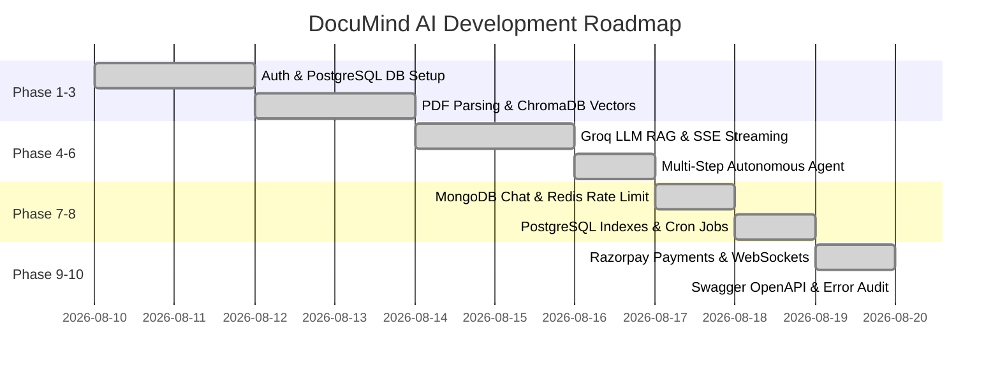

# Product Requirement Document (PRD) — DocuMind AI

**Project Name**: DocuMind AI  
**Version**: 1.0.0  
**Target Domain**: Enterprise & Academic Intelligent Document Retrieval, RAG Analysis & Autonomous Agents  
**Authors**: DocuMind Core Engineering Team  

---

## 1. Executive Summary & Vision

DocuMind AI is a full-stack, enterprise-grade AI Document Intelligence Platform that allows users to upload unstructured PDF documents, perform high-speed semantic retrieval, stream answers using state-of-the-art Large Language Models (Groq LLaMA 3.3 70B), interact with autonomous multi-step agents, and monitor usage in real-time.

The system combines hybrid multi-database persistence (PostgreSQL for relational entities, MongoDB Atlas for conversational history, Redis for caching and rate limiting, and ChromaDB for vector embeddings) with cryptographic payments (Razorpay Test Mode) and full-duplex WebSocket status pipelines (Socket.IO).

---

## 2. Target Audience & User Personas

1. **Academic Researchers & Students**: Need to upload 50+ page research papers and quickly extract methodologies, synthesize literature, and generate study quizzes.
2. **Legal & Compliance Analysts**: Require precise semantic search across contractual PDFs with verified chunk-level citations and similarity scores.
3. **Enterprise Teams**: Need role-based access control (RBAC), API rate-limiting, and cost/token tracking per document.

---

## 3. Core Functional Requirements

### 3.1 Authentication, Authorization & User Management
* **JWT-Based Authentication**: Secure authentication via JSON Web Tokens signed with HMAC SHA-256 and 24-hour expiration.
* **Password Hashing**: Secure salted password hashing using `bcrypt` (10 salt rounds).
* **Role-Based Access Control (RBAC)**: Distinct permissions for `USER` and `ADMIN` roles.
* **Subscription Management**: Support for `FREE` and `PRO` plans with status tracking (`ACTIVE`, `INACTIVE`, `CANCELLED`).

### 3.2 PDF Ingestion & Vector Processing Pipeline
* **Secure PDF Upload**: Multi-layer upload security (strict MIME whitelist `application/pdf`, extension validation, 10MB file limit, UUID filename obfuscation).
* **Text Extraction & Chunking**: Sliding-window recursive text chunking (~500 tokens per chunk with 10% overlap).
* **High-Dimensional Vector Embeddings**: Generation of 2048-dimensional dense vector embeddings using NVIDIA Nemotron-3 (via OpenRouter API).
* **Vector Indexing & Retrieval**: Storage and cosine similarity search in ChromaDB.

### 3.3 AI Reasoning, Streaming & Autonomous Agents
* **RAG (Retrieval-Augmented Generation)**: Vector search retrieves top-k relevant chunks; injected into Groq LLaMA 3.3 70B context window.
* **Real-Time Token Streaming**: Server-Sent Events (SSE) streaming delivering sub-second first-token latency.
* **Multi-Step Autonomous Agent**: Autonomous agent capable of multi-step tool execution:
  - `summarize_document`: Structured document summarization.
  - `generate_quiz`: Generates multi-choice comprehension quizzes.
  - `search_document`: Deep vector similarity queries.
* **Prompt Injection Defense**: Multi-tier sanitization stripping system prompt overrides, delimiter attacks, and role spoofing attempts.

### 3.4 Hybrid Storage & Performance
* **PostgreSQL (Prisma ORM)**: Relational schema for Users, Documents, AIUsage, and Subscription transactions with indexing on `userId`, `createdAt`, and `documentId`.
* **MongoDB (Mongoose)**: Document-store chat session persistence (`ChatSession`) maintaining chronological conversation history.
* **Redis**:
  - Response caching for identical Q&A queries (TTL 10 mins).
  - Sliding-window IP/User rate limiting (e.g. 30 requests/hour for AI endpoints).
* **Scheduled Cron Jobs**: Automated background cleanup of stale usage logs.

### 3.5 Real-Time Communication & Payments
* **WebSocket Document Status Tracker (Socket.IO)**: Real-time progress updates (`uploading` ➔ `extracting` ➔ `chunking` ➔ `embedding` ➔ `storing_vectors` ➔ `completed`). Handshake secured via JWT; user room isolation (`user:${userId}`).
* **Payment Gateway (Razorpay Test Mode)**: Server-side order creation (`POST /api/payments/create-order`) and cryptographic HMAC SHA-256 signature verification (`POST /api/payments/verify`) before upgrading users to `PRO`.

### 3.6 Developer Experience & API Standards
* **OpenAPI 3.0 & Swagger UI**: Interactive API documentation hosted at `GET /api-docs` and `GET /api-docs/swagger.json`.
* **Standardized Error Responses**: Uniform error response envelope (`{ success: false, message, error: { code, details } }`).

---

## 4. Non-Functional Requirements (NFR)

| Metric | Requirement |
|---|---|
| **Latency** | Sub-500ms initial token response time for streaming RAG queries |
| **Availability** | 99.9% uptime with graceful degradation (e.g. Redis bypass on cache down) |
| **Security** | Zero raw secrets in code/logs; constant-time crypto signature validation; production error masking |
| **Scalability** | Stateless Express backend with horizontal scalability behind reverse proxies |
| **Test Coverage** | Comprehensive automated unit & integration test suites covering Auth, Docs, AI, Payment, WebSockets, Rate Limiting, and Swagger |

---

## 5. System Scope & Release Roadmap

