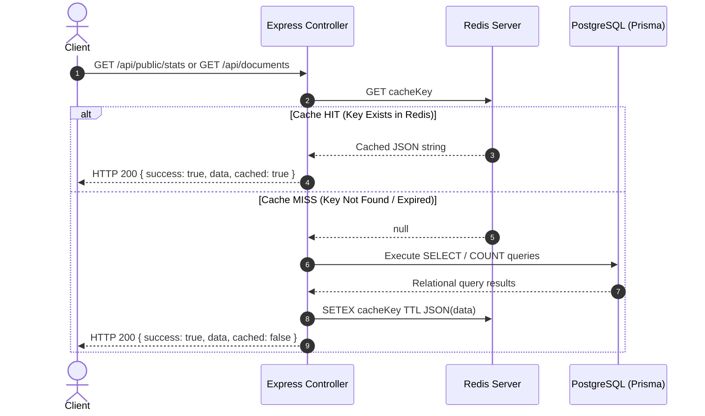
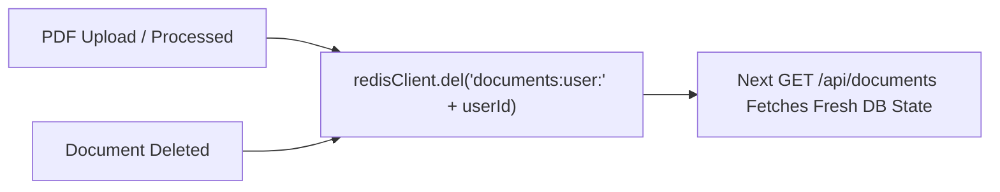

# DocuMind AI — Redis Caching Architecture

This document describes the Cache-Aside caching pattern, cache key hierarchies, Time-to-Live (TTL) policies, automatic invalidation triggers, and viva defense concepts implemented in DocuMind AI.

---

## 1. Cache-Aside Pattern Lifecycle

DocuMind AI implements the **Cache-Aside (Lazy-Loading)** pattern on read-heavy endpoints to minimize PostgreSQL query overhead and deliver sub-millisecond responses.

---

## 2. Cached Endpoints & Key Structure

| Endpoint | Cache Key Format | TTL | Invalidation Triggers |
|---|---|---|---|
| `GET /api/public/stats` | `stats:public` | 60 seconds | Auto-expires on TTL expiry (short TTL prevents stale metrics) |
| `GET /api/documents` | `documents:user:{userId}` | 30 seconds | Explicitly purged on `uploadDocument` and `deleteDocument` |

---

## 3. Cache Invalidation Flow

To prevent users from seeing outdated document lists, write operations explicitly purge the corresponding user's cache key:

---

## 4. Fault Tolerance & Fallback Strategy

* **Non-Blocking Cache Failure**: All Redis `get`, `setEx`, and `del` operations are wrapped in safe try/catch blocks.
* **Seamless DB Fallback**: If Redis crashes, restarts, or experiences high network latency, the controller gracefully logs a warning and queries PostgreSQL directly without returning an error to the client.

---

## 5. Viva Defense Q&A

### Q1: Why do we include the `userId` in the document list cache key (`documents:user:{userId}`)?
> **Answer**: If we used a generic key like `documents:list`, the first user who makes a request would cache their private documents for all other users to see, creating a critical multi-tenant data leak. Scoping the cache key to `documents:user:{userId}` ensures strict tenant isolation.

### Q2: What is the Cache-Aside pattern, and why did we choose it over Write-Through?
> **Answer**: In Cache-Aside, the application only loads data into the cache when it is explicitly requested (on-demand). If data is never read, it is never cached, saving memory. Write-Through would write every newly uploaded or modified record to cache immediately, which wastes Redis RAM on records that may not be queried frequently.
