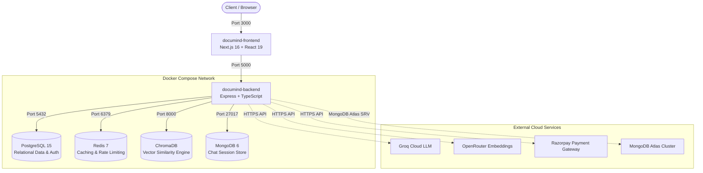

# Containerization with Docker & Multi-Service Orchestration

This document details the Docker containerization architecture, multi-stage Dockerfiles, networking, and service orchestration for DocuMind AI.

---

## 1. System Container Topology

DocuMind AI orchestrates a polyglot multi-service architecture using **Docker Compose**.



---

## 2. Multi-Stage Dockerfiles

### 2.1 Backend Dockerfile ([backend/Dockerfile](file:///c:/Projects/documind/documind-ai/backend/Dockerfile))
Uses a multi-stage build to keep the production image lightweight, secure, and devoid of TypeScript compiler overhead:
* **Stage 1 (Builder)**: Installs development dependencies, runs `npx prisma generate` to construct database clients, and compiles TypeScript (`npm run build`).
* **Stage 2 (Runner)**: Copies only compiled JavaScript (`dist/`), production dependencies (`npm ci --omit=dev`), and Prisma runtime engines into an Alpine Linux container, exposing port 5000.

### 2.2 Frontend Dockerfile ([frontend/Dockerfile](file:///c:/Projects/documind/documind-ai/frontend/Dockerfile))
Uses a multi-stage build for Next.js:
* **Stage 1 (Builder)**: Installs dependencies and builds the optimized production bundle with Turbopack (`npm run build`).
* **Stage 2 (Runner)**: Packages the standalone `.next` build output and static public assets, exposing port 3000.

---

## 3. Docker Compose Services Matrix

| Service Name | Image / Build Context | Exposed Port | Purpose |
|---|---|---|---|
| `backend` | `./backend` (Dockerfile) | `5000:5000` | Core Express REST, SSE streaming & WebSocket API |
| `frontend` | `./frontend` (Dockerfile) | `3000:3000` | Next.js App Router client & SSR statistics |
| `postgres` | `postgres:15-alpine` | `5432:5432` | Authoritative relational user & document storage |
| `chromadb` | `chromadb/chroma:latest` | `8000:8000` | Cosine similarity vector search collection |
| `redis` | `redis:7-alpine` | `6379:6379` | Cache-Aside cache & sliding-window rate limiters |
| `mongodb` | `mongo:6` | `27017:27017` | Local chat history store (or connects to Atlas externally) |

---

## 4. Running the Containerized Stack

### 1. Validate Configuration:
```bash
docker compose config
```

### 2. Build and Start All Containers:
```bash
docker compose up --build -d
```

### 3. Verify Status:
```bash
docker compose ps
```

---

## 5. Viva Defense Q&A

### Q1: Why do we use Multi-Stage builds for the Docker images?
> **Answer**: In a single-stage build, all build tools (TypeScript compiler, `@types/*` packages, development dependencies) remain inside the final container image, inflating image size by hundreds of megabytes and introducing security vulnerabilities. Multi-stage builds compile code in a temporary builder stage and copy only the compiled artifacts (`dist/` or `.next/`) and production dependencies into the minimal runner image.

### Q2: How do containers communicate with each other inside Docker Compose?
> **Answer**: Docker Compose automatically creates a shared bridge network (`documind-ai_default`). Containers resolve each other using their service names as hostnames (e.g. `http://chromadb:8000`, `postgresql://postgres:5432/documind_db`, `redis://redis:6379`).
