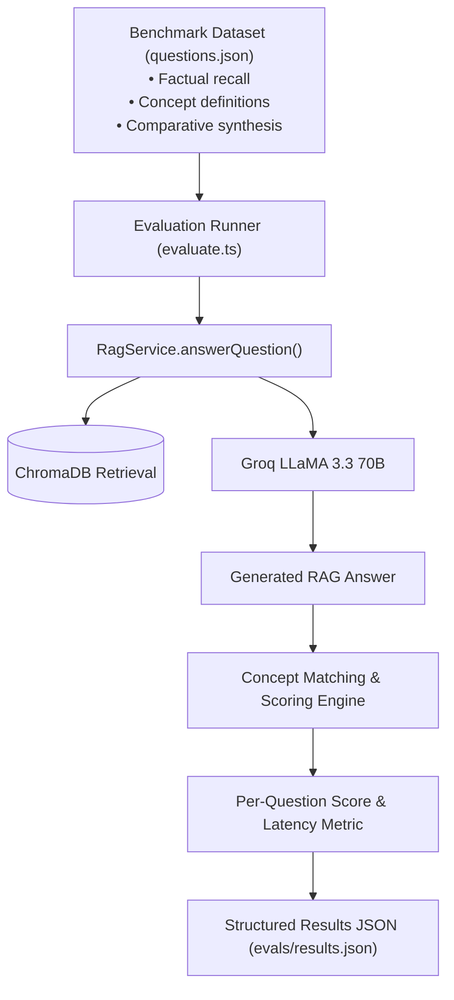

# LLM Evaluation Suite & Benchmark Dataset

This document details the automated LLM Evaluation Framework in DocuMind AI, located in `backend/evals/`.

---

## 1. Overview & Evaluation Goals

To systematically measure Retrieval-Augmented Generation (RAG) answer quality, factuality, and latency, DocuMind AI implements an automated **Evaluation Suite** (`backend/evals/evaluate.ts`) powered by a curated benchmark dataset (`backend/evals/questions.json`).



---

## 2. Evaluation Dataset Categories (`questions.json`)

The evaluation set contains curated test questions divided across cognitive categories:

| Category | Example Question | Expected Concepts | Purpose |
|---|---|---|---|
| **Factual** | *"Who created FastAPI?"* | `["Sebastián Ramírez"]` | Precision fact retrieval |
| **Factual** | *"What Python version is required for FastAPI?"* | `["3.7"]` | Exact numeric parameter extraction |
| **Definition** | *"What is Pydantic used for in FastAPI?"* | `["data validation", "data models", "serialization"]` | Multi-keyword definition fidelity |
| **Conceptual** | *"Why is FastAPI considered fast?"* | `["Starlette", "Pydantic", "asynchronous"]` | Semantic reasoning across chunks |
| **Comparison** | *"Is FastAPI faster than Flask?"* | `["faster", "asynchronous", "performance"]` | Comparative analysis |

---

## 3. Scoring Methodology

Each test case evaluates the LLM response against required semantic concepts:
* **PASS (Score: 1.0)**: 100% of expected concept keywords are present in the response.
* **PARTIAL (Score: 0.5)**: $\ge 50\%$ of expected concepts are present.
* **FAIL (Score: 0.0)**: $< 50\%$ of expected concepts are present.

### Metric Aggregation:
* **Overall Accuracy %**: $\frac{\sum \text{Scores}}{\text{Total Questions}} \times 100$
* **Average Latency**: $\text{Mean}(latencyMs)$ across all questions.

---

## 4. Running the Benchmark

```bash
cd backend
npx ts-node evals/evaluate.ts <documentId> <userId>
```

The script outputs a formatted console table and writes detailed execution traces to `backend/evals/results.json`.
