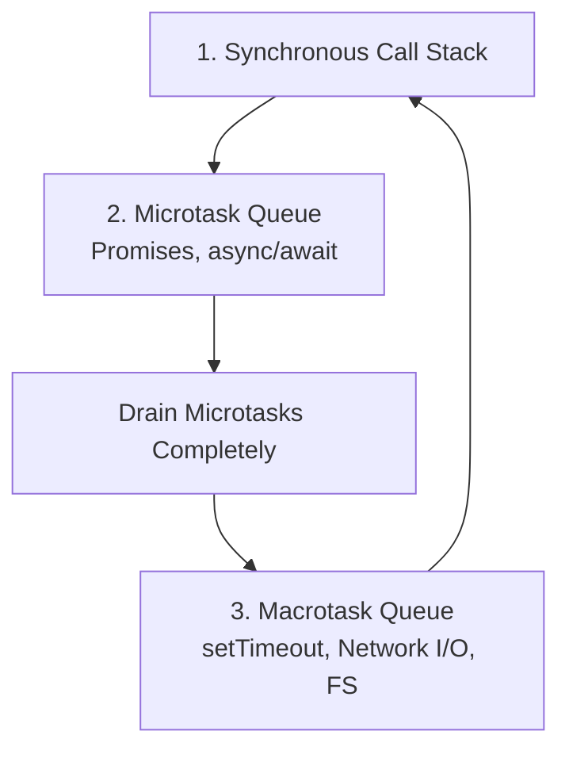

# JavaScript Core Fundamentals: Event Loop, Hoisting, Closures & Async

This document provides a concise, academic, and practical guide to core JavaScript/TypeScript runtime concepts: **Event Loop**, **Hoisting**, **Closures**, **Promises vs Callbacks**, and **Async/Await**, directly connecting these fundamentals to the architecture of DocuMind AI.

---

## 1. JavaScript Event Loop

### 1.1 How the Event Loop Works
JavaScript is single-threaded and non-blocking, driven by the **V8 engine** and **libuv** (in Node.js). It processes tasks through a structured execution priority:

1. **Call Stack**: Executes synchronous JavaScript instructions line-by-line.
2. **Microtask Queue** (High Priority): Handles Promise resolutions (`.then()`, `await`), `process.nextTick()`, and `queueMicrotask()`. Microtasks are drained completely before the next event loop tick.
3. **Macrotask / Task Queue** (Standard Priority): Handles timers (`setTimeout`, `setInterval`), I/O callbacks, and network events.



---

### 1.2 Execution Order Demonstration

```javascript
console.log("A"); // 1. Synchronous execution

setTimeout(() => {
  console.log("B"); // 4. Macrotask queue (timer callback)
}, 0);

Promise.resolve().then(() => {
  console.log("C"); // 3. Microtask queue (Promise callback)
});

console.log("D"); // 2. Synchronous execution
```

**Output:**
```
A
D
C
B
```

**Step-by-step breakdown:**
1. `console.log("A")` runs synchronously and outputs `A`.
2. `setTimeout` schedules `B` into the **Macrotask Queue** with a 0ms delay.
3. `Promise.resolve().then(...)` queues `C` into the **Microtask Queue**.
4. `console.log("D")` runs synchronously and outputs `D`.
5. The Call Stack empties. The event loop first checks and empties the **Microtask Queue**, executing `C`.
6. The event loop moves to the **Macrotask Queue** and executes `B`.

---

### 1.3 How DocuMind AI Leverages the Event Loop
* **Non-Blocking SSE Streaming**: During LLM streaming (`ai.controller.ts`), token chunks from Groq are yielded asynchronously via async generators and flushed over HTTP without blocking the Node.js main thread.
* **Background PDF Ingestion**: `pdf-parse` reads buffers asynchronously, allowing the Express server to concurrently handle other user requests while documents are ingested into ChromaDB.
* **WebSocket Real-Time Dispatch**: Socket.IO events (`document:status`) use the event loop's I/O polling phase to broadcast processing stages (`extracting`, `embedding`, `ready`) to connected frontend clients.

---

## 2. JavaScript Hoisting

### 2.1 Variable Hoisting & The Temporal Dead Zone (TDZ)
Hoisting is JavaScript's compile-time behavior of moving variable and function declarations to the top of their containing scope before code execution.

#### A. `var` Hoisting
`var` declarations are hoisted and automatically initialized with `undefined`:
```javascript
console.log(legacyVar); // Outputs: undefined (does not throw error)
var legacyVar = 42;
console.log(legacyVar); // Outputs: 42
```

#### B. `let` and `const` (Temporal Dead Zone)
`let` and `const` declarations are also hoisted, but they are **not initialized**. Accessing them before their declaration line throws a `ReferenceError` because the variable exists in the **Temporal Dead Zone (TDZ)**:
```javascript
console.log(modernLet); // Throws ReferenceError: Cannot access 'modernLet' before initialization
let modernLet = 42;
```

---

### 2.2 Function Declaration vs Function Expression Hoisting

#### Function Declarations (Hoisted with Definition)
Function declarations are hoisted completely into memory along with their function body, allowing them to be called before their definition in the source file:
```javascript
greet(); // Outputs: "Welcome to DocuMind AI!"

function greet() {
  console.log("Welcome to DocuMind AI!");
}
```

#### Function Expressions & Arrow Functions (Not Hoisted as Functions)
When assigned to `const` or `let`, only the variable identifier is hoisted (into the TDZ), so calling it beforehand throws a `ReferenceError` or `TypeError`:
```javascript
search(); // Throws ReferenceError: Cannot access 'search' before initialization

const search = () => {
  console.log("Executing semantic search...");
};
```

---

## 3. Closures

A **closure** is the combination of a function bundled together with references to its surrounding state (the lexical environment). In JavaScript, closures give inner functions access to an outer function's scope even after the outer function has finished executing.

```javascript
function createTokenBucket(maxTokens, refillRatePerSec) {
  let tokens = maxTokens; // Encapsulated private state

  return function consume() {
    if (tokens > 0) {
      tokens -= 1;
      return { allowed: true, remaining: tokens };
    }
    return { allowed: false, remaining: 0 };
  };
}

const limiter = createTokenBucket(5, 1);
console.log(limiter()); // { allowed: true, remaining: 4 }
console.log(limiter()); // { allowed: true, remaining: 3 }
```

### Application in DocuMind AI:
* Middleware generators in Express (`rateLimiter`, `authMiddleware`) return request handler closures that retain references to configuration options (e.g. `limit`, `windowMs`, `role`).

---

## 4. Promises vs Callbacks & Async / Await

### 4.1 Evolution from Callbacks to Promises
* **Callbacks**: Passing a function as an argument to be invoked once an asynchronous task finishes. Deep nesting of callbacks creates "Callback Hell" and fragile error propagation.
* **Promises**: Objects representing the eventual completion (or failure) of an asynchronous operation, enabling linear `.then().catch()` chains.

```javascript
// Legacy Callback Style (Error-prone nesting)
fs.readFile("doc.pdf", (err, data) => {
  if (err) return handleError(err);
  extractText(data, (err, text) => {
    if (err) return handleError(err);
    generateEmbedding(text, (err, vector) => {
      // Callback Hell
    });
  });
});

// Modern Promise Style (Clean chaining)
fs.promises.readFile("doc.pdf")
  .then(data => extractText(data))
  .then(text => generateEmbedding(text))
  .catch(err => handleError(err));
```

---

### 4.2 `async / await` in DocuMind AI
`async/await` is syntactic sugar built directly on top of Promises, allowing asynchronous code to be read and written synchronously while preserving non-blocking event-loop execution.

```typescript
// Asynchronous Document Ingestion in DocuMind AI
async function ingestDocument(fileBuffer: Buffer, userId: string): Promise<DocumentResult> {
  try {
    const text = await extractPdfText(fileBuffer);
    const chunks = chunkText(text, 500);
    const embeddings = await embeddingService.generateBatch(chunks);
    await vectorService.storeEmbeddings(userId, embeddings);
    return { success: true, totalChunks: chunks.length };
  } catch (error) {
    console.error("Ingestion failed:", error);
    throw new AppError("EXTRACTION_ERROR", "Failed to process PDF document");
  }
}
```
