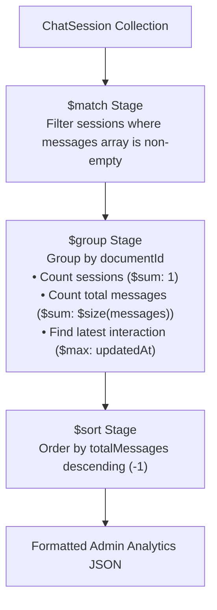

# MongoDB Architecture: Referencing, Embedding & Aggregation Pipelines

This document details the MongoDB (Mongoose) architecture in DocuMind AI, demonstrating **Embedding vs Referencing relationships**, **Aggregation Pipelines**, and **Indexing**.

---

## 1. Embedding vs Referencing Relationships

In a polyglot persistence architecture, DocuMind AI combines **PostgreSQL** (relational, structured entity storage) with **MongoDB Atlas** (flexible, nested chat conversations).

```mermaid
graph TD
    subgraph PostgreSQL [PostgreSQL (Relational Store)]
        User["User Table (id: UUID)"]
        Document["Document Table (id: UUID)"]
    end

    subgraph MongoDB [MongoDB Atlas (NoSQL Document Store)]
        ChatSession["ChatSession Collection<br/>• _id: ObjectId<br/>• userId: UUID (Reference)<br/>• documentId: UUID (Reference)"]
        Messages["Embedded Messages Array<br/>[<br/>  { role: 'user', content: '...', createdAt: Date },<br/>  { role: 'assistant', content: '...', createdAt: Date }<br/>]"]
    end

    User -.->|Referenced by UUID| ChatSession
    Document -.->|Referenced by UUID| ChatSession
    ChatSession === Messages
```

### 1.1 Referencing (PostgreSQL Foreign IDs)
* `ChatSession.userId`: References `User.id` in PostgreSQL.
* `ChatSession.documentId`: References `Document.id` in PostgreSQL.
* **Why Referencing?** The authoritative user credentials, profile data, subscription plan, and document text live in PostgreSQL. Storing references (`userId`, `documentId`) prevents multi-database synchronization anomalies and avoids duplicate storage of user/document data in MongoDB.

### 1.2 Embedding (Message Subdocuments)
* `messages: [messageSchema]` is an embedded subdocument array inside `ChatSession`.
* **Why Embedding?** Messages are always fetched together with the chat session and are tightly bound to a single conversation lifecycle. Embedding eliminates cross-collection lookups, providing atomic append operations (`$push`) in a single query.

---

## 2. MongoDB Schema Definition ([ChatSession.ts](file:///c:/Projects/documind/documind-ai/backend/src/models/ChatSession.ts))

```typescript
const messageSchema = new Schema<IMessage>({
  role: { type: String, enum: ['user', 'assistant', 'system'], required: true },
  content: { type: String, required: true },
  createdAt: { type: Date, default: Date.now },
});

const chatSessionSchema = new Schema<IChatSession>(
  {
    userId: { type: String, required: true },      // Reference to PostgreSQL User
    documentId: { type: String, required: true },  // Reference to PostgreSQL Document
    messages: { type: [messageSchema], default: [] }, // Embedded subdocuments
  },
  {
    timestamps: true,
  }
);

// Compound Index for O(1) query performance
chatSessionSchema.index({ userId: 1, documentId: 1 });
chatSessionSchema.index({ updatedAt: -1 });
```

---

## 3. Aggregation Pipeline Implementation

DocuMind AI implements a multi-stage **Aggregation Pipeline** to compute conversation metrics across documents without exposing raw message contents.

### Endpoint: `GET /api/admin/chat-stats`
* **Route**: `backend/src/routes/admin.routes.ts`
* **Controller**: `backend/src/controllers/admin.controller.ts`
* **Authorization**: JWT + `ADMIN` role.



### Pipeline Code:
```typescript
const stats = await ChatSession.aggregate([
  // Stage 1: $match - Filter out empty sessions
  {
    $match: {
      'messages.0': { $exists: true },
    },
  },
  // Stage 2: $group - Group by documentId and compute aggregates
  {
    $group: {
      _id: '$documentId',
      totalSessions: { $sum: 1 },
      totalMessages: { $sum: { $size: '$messages' } },
      lastInteraction: { $max: '$updatedAt' },
    },
  },
  // Stage 3: $sort - Order by most active document chats
  {
    $sort: {
      totalMessages: -1,
    },
  },
]);
```

### Aggregation Result:
```json
{
  "success": true,
  "data": [
    {
      "documentId": "1279a0b1-3e4b-4b1a-9f5e-8b9f7a8b9c0d",
      "totalSessions": 5,
      "totalMessages": 42,
      "lastInteraction": "2026-08-20T16:15:00.000Z"
    }
  ]
}
```

---

## 4. Viva Defense Q&A

### Q1: When should you use Embedding vs Referencing in MongoDB?
> **Answer**: Use **Embedding** for 1-to-Few or 1-to-Bounded relationships where child entities are always read and modified with the parent (such as `messages` in a `ChatSession`). Use **Referencing** for 1-to-Many or Many-to-Many relationships, or when child entities relate across different database boundaries (such as `userId` and `documentId` pointing to PostgreSQL).

### Q2: How does the MongoDB Aggregation Pipeline differ from a basic `find()` query?
> **Answer**: `find()` retrieves raw document records. An **Aggregation Pipeline** executes a multi-stage data processing workflow directly on the database engine. Stages like `$match` filter documents early, `$group` computes statistical aggregates (`$sum`, `$avg`, `$max`), and `$sort` orders the results before sending data over the network, minimizing memory overhead and network bandwidth.
