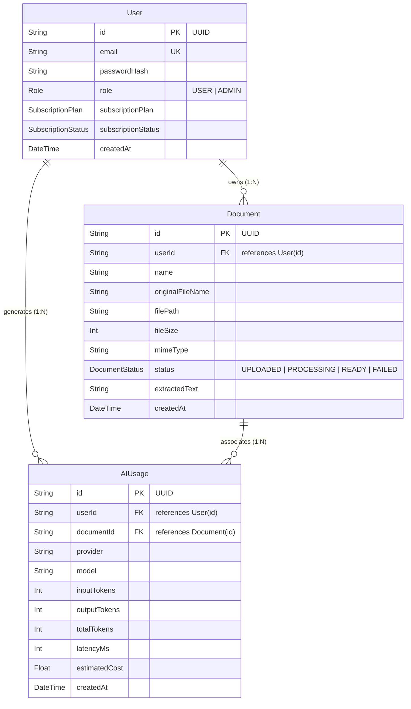

# Relational Schema Design & SQL JOINs in DocuMind AI

This document details the PostgreSQL relational database architecture, Primary/Foreign Key relationships, and SQL JOIN implementation in DocuMind AI.

---

## 1. Entity Relationships (PK / FK)

DocuMind AI uses PostgreSQL managed by Prisma ORM for authoritative user accounts, document metadata, and AI usage tracking.



* **Primary Key (PK)**: `id String @id @default(uuid())` is a globally unique identifier on each entity.
* **Foreign Key (FK)**: `Document.userId` references `User.id` with `@relation(fields: [userId], references: [id], onDelete: Cascade)`.
* **Data Integrity**: Deleting a User cascades and safely purges all associated documents and AI usages.

---

## 2. SQL JOIN Implementation

To prevent data duplication (e.g. storing user emails inside the document table), document records only store the foreign key `userId`. When an administrator views the system-wide document catalog, the application combines the two tables using a relational **SQL JOIN**.

### Endpoint: `GET /api/admin/documents`
* **Controller**: `backend/src/controllers/admin.controller.ts`
* **Protection**: JWT authentication + `ADMIN` role check.

```typescript
// Prisma Relational JOIN Query
const documents = await prisma.document.findMany({
  include: {
    user: {
      select: {
        email: true,
      },
    },
  },
  orderBy: {
    createdAt: 'desc',
  },
});
```

### Generated SQL Execution:
Prisma executes a relational query equivalent to:
```sql
SELECT 
    d.id AS "documentId",
    d."originalFileName" AS "fileName",
    d.status AS "status",
    d."createdAt" AS "createdAt",
    u.email AS "ownerEmail"
FROM "Document" d
LEFT JOIN "users" u ON d."userId" = u.id
ORDER BY d."createdAt" DESC;
```

---

## 3. Response Format
```json
{
  "success": true,
  "data": [
    {
      "documentId": "1279a0b1-3e4b-4b1a-9f5e-8b9f7a8b9c0d",
      "fileName": "lecture-notes.pdf",
      "status": "READY",
      "ownerEmail": "student@example.com",
      "createdAt": "2026-08-20T14:30:00.000Z"
    }
  ]
}
```

---

## 4. Viva Defense Q&A

### Q1: Why use a Foreign Key instead of storing the owner's email directly inside the Document table?
> **Answer**: Storing `ownerEmail` in the `Document` table violates Second and Third Normal Forms (2NF/3NF). If the user changes their email address, we would need to update every document record in the database (update anomaly risk). With a Foreign Key `userId`, the user's email exists in exactly one place (`User` table), and we dynamically join the tables when needed.

### Q2: How does Prisma perform the JOIN?
> **Answer**: When `include: { user: { select: { email: true } } }` is supplied, Prisma issues a `LEFT JOIN` on the foreign key relation (`Document.userId = User.id`), fetching the linked user record in a single optimized database query.
