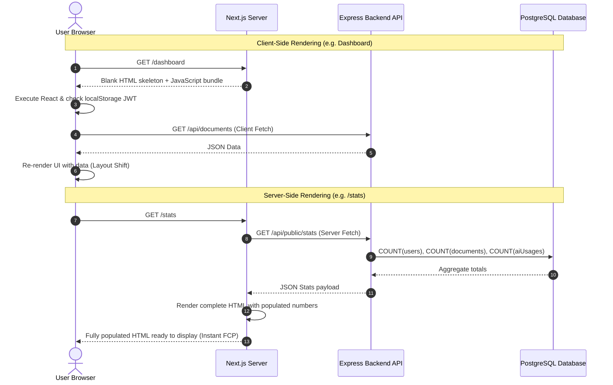

# Server-Side Rendering (SSR) in DocuMind AI

This document details the Server-Side Rendering (SSR) architecture, React Server Components implementation, and performance benefits in DocuMind AI.

---

## 1. Client-Side Rendering (CSR) vs Server-Side Rendering (SSR)



---

## 2. Server Component Implementation ([frontend/src/app/stats/page.tsx](file:///c:/Projects/documind/documind-ai/frontend/src/app/stats/page.tsx))

The public statistics page is implemented as an asynchronous React Server Component:

1. **No `'use client'` Directive**: Instructs Next.js Turbopack to execute this component exclusively on the Node.js server.
2. **`export const dynamic = 'force-dynamic'`**: Bypasses static caching, ensuring fresh relational database counts are retrieved on each request.
3. **No Browser API Dependencies**: Does not use `window`, `document`, `localStorage`, or `useEffect`, ensuring zero hydration mismatches.

```tsx
export const dynamic = 'force-dynamic';

async function fetchStats() {
  const apiUrl = process.env.INTERNAL_API_URL || process.env.NEXT_PUBLIC_API_URL || 'http://localhost:5000';
  const res = await fetch(`${apiUrl}/api/public/stats`, { cache: 'no-store' });
  return res.ok ? res.json() : null;
}

export default async function PublicStatsPage() {
  const statsResponse = await fetchStats();
  const stats = statsResponse?.data || { totalUsers: 0, totalDocuments: 0, totalAIUsages: 0 };
  
  return (
    <div>
      <h1>DocuMind AI Platform Stats</h1>
      <p>Users: {stats.totalUsers}</p>
      <p>Documents: {stats.totalDocuments}</p>
    </div>
  );
}
```

---

## 3. Benefits of SSR in DocuMind AI

* **Search Engine Optimization (SEO)**: Search engine web crawlers receive a complete HTML document containing live platform statistics without needing to execute client-side JavaScript.
* **Fast First Contentful Paint (FCP)**: The user sees meaningful data immediately upon receiving the initial HTTP response without waiting for client-side API roundtrips.
* **Tenant Security Isolation**: Because Server Components run in a trusted server environment, public metrics can be rendered without exposing internal database schemas to the browser.
